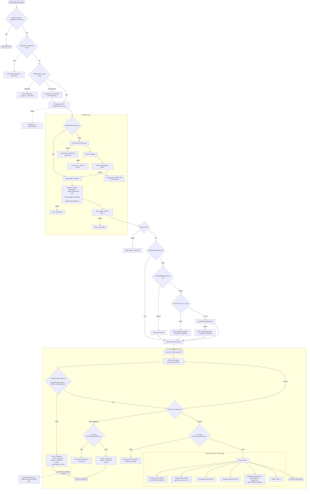
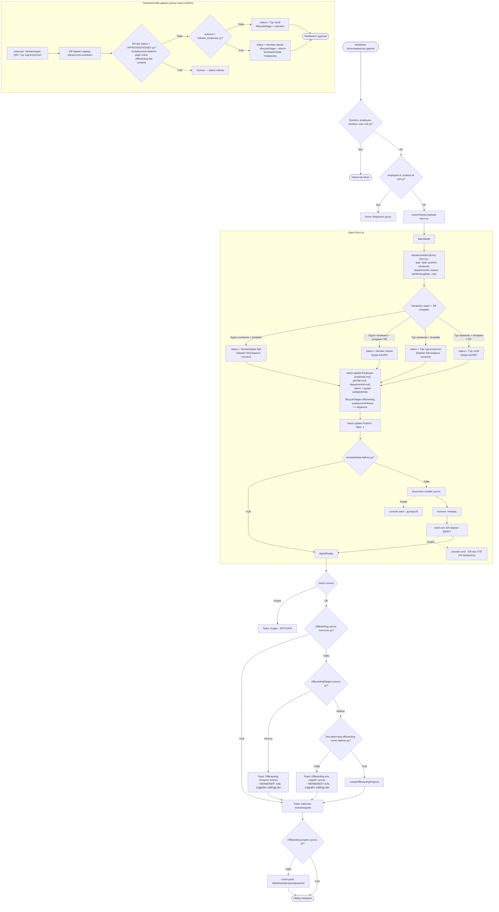

# Ажилтан албан тушаалд томилох болон чөлөөлөх процессийн зураглал (v2 — Аудит)

Энэ баримт нь HR системийн **томилох** болон **чөлөөлөх** үйл явцын бүрэн процессын flowchart-уудыг кодын аудитад тулгуурлан нарийвчлан тодорхойлно.

> Хувилбар 2 — аудитаар илэрсэн бүх орхигдуулсан нөхцөл, алдааны гарц, edge case-ийг тусгасан.

---

## 1. Томилох процесс (Appointment) — Хэсэг A: Оролтын цэгүүд

Оролтын цэг тус бүр **ялгаатай урьдчилсан шалгалт** хийдэг. Dialog өөрөө `isApproved`, `filled`, `бэлтгэл` шалгалт хийдэггүй — дуудагч тал хариуцна.

```mermaid
flowchart TB
    subgraph dashboardEntry ["Dashboard: Чирж буулгах"]
        D1[Ажилтан node-г Position node руу чирэх]
        D1 --> D2{source=unassigned, target=position уу?}
        D2 -->|Үгүй| D2stop([Чимээгүй зогсох])
        D2 -->|Тийм| D3{filled gte 1 уу?}
        D3 -->|Тийм| D3err["Toast: Орон тоо дүүрсэн"]
        D3 -->|Үгүй| D4{position_preparation project байгаа уу?}
        D4 -->|Байхгүй| D4err["Toast: Ажлын байр бэлтгэгдээгүй"]
        D4 -->|Байгаа| D5{Бүх таск DONE уу?}
        D5 -->|Үгүй| D5err["Toast: Бэлтгэл дуусаагүй"]
        D5 -->|Тийм| D6[AppointEmployeeDialog нээх]
        D4 -.->|Query алдаа| D4qerr["Toast: Бэлтгэл шалгах алдаа"]
    end

    subgraph posPageEntry ["Position Page: Томилох товч"]
        P1{position.isApproved уу?}
        P1 -->|Үгүй| P1hide([Товч харагдахгүй])
        P1 -->|Тийм| P2{isPrepCompleted уу?}
        P2 -->|Үгүй| P2alt["Бэлтгэх товч харуулах"]
        P2 -->|Тийм| P3[Томилох товч идэвхтэй]
        P3 --> P4[AppointEmployeeDialog нээх]
    end

    subgraph flowCanvasEntry ["Flow Canvas: Томилох"]
        FC1[Байр дээрх Томилох товч дарах]
        FC1 --> FC2{position.isApproved уу?}
        FC2 -->|Үгүй| FC2err["Toast: Ажлын байр батлагдаагүй"]
        FC2 -->|Тийм| FC3{filled gte 1 уу?}
        FC3 -->|Тийм| FC3err["Toast: Орон тоо дүүрсэн"]
        FC3 -->|Үгүй| FC4[AppointEmployeeDialog нээх]
    end

    subgraph companyEntry ["Company Page: CEO томилох"]
        CO1[CEO байр дээр Томилох товч]
        CO1 --> CO2[AppointEmployeeDialog нээх]
    end
```



---

## 2. Томилох процесс — Хэсэг B: Dialog дотоод урсгал (Wizard)

```mermaid
flowchart TB
    subgraph wizardSteps ["AppointEmployeeDialog Wizard"]
        Start([Dialog нээгдсэн]) --> InitCheck{initialEmployee дамжуулсан уу?}
        InitCheck -->|Тийм| OffbCheck1{Offboarding шалгалт 1-р удаа}
        InitCheck -->|Үгүй| Step1[Step 1: Ажилтан сонгох]

        OffbCheck1 -->|Идэвхтэй| OffbWarn1["Toast: Offboarding идэвхтэй - status=active"]
        OffbCheck1 -->|Check алдаа| OffbSkip1["console.error, status=none - ҮРГЭЛЖИЛНЭ"]
        OffbCheck1 -->|Үгүй| Step2
        OffbWarn1 --> OffbBlock([Ажилтан сонголт хориглогдоно])

        Step1 --> EmpSelect[Шүүлт: status=Идэвхтэй, positionId хоосон]
        EmpSelect --> SelEmp[Ажилтан сонгох]
        SelEmp --> OffbCheck1b{Offboarding шалгалт}
        OffbCheck1b -->|Идэвхтэй| OffbWarn1b["Toast: Offboarding идэвхтэй"]
        OffbCheck1b -->|Үгүй| Step2

        Step2[Step 2: Томилгооны төрөл сонгох]
        Step2 --> TypeSelect{Сонголт}
        TypeSelect --> T1[appointment_permanent: Үндсэн ажилтнаар]
        TypeSelect --> T2[appointment_probation: Туршилтын хугацаатай]
        TypeSelect --> T3[appointment_reappoint: Эргүүлэн томилох]

        T1 --> ActionCheck{organization_actions тохиргоо шалгах}
        T2 --> ActionCheck
        T3 --> ActionCheck

        ActionCheck -->|templateId байхгүй| ActErr1["Toast: Загвар тохируулаагүй - ЗОГСОНО"]
        ActionCheck -->|dateMappings дутуу| ActErr2["Toast: Огнооны талбар холбоогүй - ЗОГСОНО"]
        ActionCheck -->|Тийм| Step3

        Step3{Цалингийн шат байгаа уу?}
        Step3 -->|Тийм| SalStep[Step 3: Цалингийн шат сонгох]
        Step3 -->|Үгүй| Step4
        SalStep --> Step4

        Step4{Урамшуулал байгаа уу?}
        Step4 -->|Тийм| IncStep[Step 4: Урамшуулал сонгох]
        Step4 -->|Үгүй| Step5
        IncStep --> Step5

        Step5{Хангамж байгаа уу?}
        Step5 -->|Тийм| AllStep[Step 5: Хангамж сонгох]
        Step5 -->|Үгүй| Step6
        AllStep --> Step6

        Step6[Step 6: Onboarding идэвхжүүлэх эсэх]
        Step6 --> OnbQ{Onboarding сонгосон уу?}
        OnbQ -->|Тийм| OnbStages["Step 7-10: 4 үе шат бүрт таск, огноо, эзэмшигч"]
        OnbQ -->|Үгүй| DocInputQ

        OnbStages --> OnbValid{Таск бүрт dueDate + ownerId бөглөгдсөн уу?}
        OnbValid -->|Үгүй| OnbBlock(["Дараах товч идэвхгүй"])
        OnbValid -->|Тийм| DocInputQ

        DocInputQ{Template-д customInputs байгаа уу?}
        DocInputQ -->|Тийм| DocInputs[Step 11: Баримтын талбарууд бөглөх]
        DocInputQ -->|Үгүй| Submit

        DocInputs --> CIValid{Required талбарууд бүгд бөглөгдсөн уу?}
        CIValid -->|Үгүй| CIBlock(["Баталгаажуулах товч идэвхгүй"])
        CIValid -->|Тийм| Submit

        Submit[Баталгаажуулах дарах]
    end
```



---

## 3. Томилох процесс — Хэсэг C: Submit ба Post-Submit урсгал



---

## 4. Чөлөөлөх процесс (Release) — Хэсэг A: Dialog дотоод урсгал

```mermaid
flowchart TB
    subgraph releaseDialog ["ReleaseEmployeeDialog"]
        Start2([Position page-аас Чөлөөлөх товч дарах])
        Start2 --> DialogOpen[Dialog нээгдэнэ]
        DialogOpen --> Step1R[Step 1: Төрөл сонгох]

        Step1R --> PendingCheck{"hasPendingAppointment:
        status=Томилогдож буй
        AND docs not SIGNED/APPROVED/ACKNOWLEDGED/SENT?"}

        PendingCheck -->|Тийм| ShowCancel["Томилгоо цуцлах товч харуулах"]
        PendingCheck -->|Үгүй| ShowRelease[Зөвхөн чөлөөлөх сонголтууд]
        PendingCheck -.-> PendingNote["Query: appointment_permanent,
        appointment_probation, appointment_reappoint + legacy IDs"]

        ShowCancel --> CancelOrRelease{Хэрэглэгч юу сонгох вэ?}
        CancelOrRelease -->|Томилгоо цуцлах| CancelPending

        subgraph cancelPendingOps ["handleCancelPendingAppointment"]
            CancelPending[Guard: firestore, employee, position, user]
            CancelPending --> CP1["ER docs устгах: not SIGNED/APPROVED/ACKNOWLEDGED/SENT"]
            CancelPending --> CP2["Onboarding processes устгах: employeeId query"]
            CancelPending --> CP3["Onboarding projects устгах: type=onboarding + employeeId"]
            CancelPending --> CP4["Employee: status=Идэвхтэй бүрдүүлэлт,
            lifecycleStage=candidate,
            positionId/jobTitle/departmentId=null"]
            CancelPending --> CP5["Position: filled -1"]
        end
        CancelPending --> CPCommit{batch.commit}
        CPCommit -->|OK| CPSuccess["Toast: Томилгоо цуцлагдлаа + router.refresh"]
        CPCommit -->|Алдаа| CPFail["Toast: Алдаа гарлаа"]
        CPSuccess --> DialogClose([Dialog хаагдана])

        CancelOrRelease -->|Чөлөөлөх сонгох| ShowRelease

        ShowRelease --> TypeSelect2{Чөлөөлөх төрөл}
        TypeSelect2 --> RT1["release_company: Компанийн санаачилгаар"]
        TypeSelect2 --> RT2["release_employee: Ажилтны санаачилгаар"]
        TypeSelect2 --> RT3["release_temporary: Түр чөлөөлөх"]

        RT1 --> ActionCheck2{handleSelectReleaseType: organization_actions шалгах}
        RT2 --> ActionCheck2
        RT3 --> ActionCheck2

        ActionCheck2 -->|templateId байхгүй| RActErr1["Toast: Загвар тохируулаагүй - ЗОГСОНО step 1-д"]
        ActionCheck2 -->|dateMappings дутуу| RActErr2["Toast: Огнооны талбар холбоогүй - ЗОГСОНО"]
        ActionCheck2 -->|Query алдаа| RActErr3["Toast: Тохиргоо шалгах алдаа - ЗОГСОНО"]
        ActionCheck2 -->|OK| Step2R[Step 2 руу шилжих]

        Step2R --> TemplateLoad{templateData ачаалагдсан уу?}
        TemplateLoad -->|Ачаалж байна| LoadSpin[Loader харуулах]
        TemplateLoad -->|Template байгаа| CustomInputs[Custom inputs бөглөх]
        TemplateLoad -->|Template null| NoTemplateWarn["Анхааруулга: Баримт загвар тохируулаагүй
        - ЧӨЛӨӨЛӨХ БОЛОМЖТОЙ ХЭВЭЭР"]

        CustomInputs --> CIValid2{Required талбарууд бөглөгдсөн уу?}
        CIValid2 -->|Үгүй| CIBlock2(["Баталгаажуулах товч идэвхгүй"])
        CIValid2 -->|Тийм| OffbToggle

        NoTemplateWarn --> OffbToggle

        OffbToggle[Offboarding хөтөлбөр эхлүүлэх toggle]
        OffbToggle --> OffbOn{Toggle ON болгох уу?}
        OffbOn -->|ON| OffbExist{existingOffboardingProjects байгаа уу?}
        OffbExist -->|Тийм| OffbExistWarn["Toast: Offboarding аль хэдийн үүссэн - toggle=OFF буцаана"]
        OffbExist -->|Үгүй| OffbEnabled[Offboarding идэвхжсэн]
        OffbOn -->|OFF| ReadySubmit

        OffbEnabled --> OffbConfigCheck{offboardingStages хоосон уу?}
        OffbConfigCheck -->|Хоосон| OffbEmptyErr["Toast: Offboarding тохиргоо хоосон - ЗОГСОНО"]
        OffbConfigCheck -->|Байгаа| OffbSteps["Step 3+: Үе бүрт таск, огноо, хариуцагч"]
        OffbSteps --> OffbStageValid{Таск бүрт dueDate + ownerId уу?}
        OffbStageValid -->|Үгүй| OffbBlock(["Дараах товч идэвхгүй"])
        OffbStageValid -->|Тийм| ReadySubmit

        ReadySubmit[Чөлөөлөх баталгаажуулах дарах]
    end
```



---

## 5. Чөлөөлөх процесс — Хэсэг B: Submit ба Post-Submit урсгал



---

## 6. Товч лавлагаа (Аудит шинэчилсэн)

### Томилох — оролтын цэгийн ялгаа

| Шалгалт | Dashboard | Position Page | Flow Canvas | Dialog дотор |
|---------|-----------|---------------|-------------|-------------|
| `isApproved` | UI-д л шүүгддэг, handler-д **БАЙХГҮЙ** | Товч харагдах нөхцөл | **ЗАСАГДСАН: Toast шалгалт** | **БАЙХГҮЙ** |
| `filled < 1` | Handler-д шалгадаг | UI-д шалгадаг | **ЗАСАГДСАН: Toast шалгалт** | **БАЙХГҮЙ** |
| Бэлтгэл дууссан | Handler-д query-ээр шалгадаг | Товч харагдах нөхцөл | — (бэлтгэл системд холбогдоогүй) | **БАЙХГҮЙ** |
| Offboarding check | **БАЙХГҮЙ** | **БАЙХГҮЙ** | **БАЙХГҮЙ** | Dialog дотор 2 удаа |

### Error handling стратеги

| Алхам | Алдааны зан авир |
|-------|-----------------|
| ER баримт үүсгэх | catch + console.error → **ҮРГЭЛЖИЛНЭ** |
| Employee update | throw → **ЗОГСОНО** |
| Position update | throw → **ЗОГСОНО** |
| Batch commit | throw → **ЗОГСОНО** |
| Onboarding projects | catch + toast → **ҮРГЭЛЖИЛНЭ** (томилгоо хэвээр) |
| Document number | catch + console.warn → **ҮРГЭЛЖИЛНЭ** |
| Offboarding 2-р шалгалт (томилох) | catch + console.warn → **АЛГАСАЖ ҮРГЭЛЖИЛНЭ** |
| Company/Dept fetch | catch + console.warn → **ҮРГЭЛЖИЛНЭ** |

### Firestore өөрчлөлтүүд (шинэчилсэн)

| Үйлдэл | employees | positions | er_documents | projects | onboarding_processes |
|---------|-----------|-----------|--------------|----------|---------------------|
| Томилох | positionId, jobTitle, departmentId, status=Томилогдож буй, lifecycleStage=onboarding, **appointedCompensation** | filled +1 | DRAFT (алдаа бол үүсэхгүй ч үргэлжилнэ) | onboarding (batch-ийн дараа, алдаа бол toast) | — |
| Авто-баталгаажуулах | status → Идэвхтэй туршилт/үндсэн, **lifecycleStage=active** | — | — | — | — |
| Гар баталгаажуулах | status → Идэвхтэй туршилт/үндсэн | — | — | — | — |
| Томилгоо цуцлах (position page) | positionId=null, status=Идэвхтэй бүрдүүлэлт, lifecycleStage=candidate | filled -1 | DRAFT устгах + actionId-аар query | onboarding устгах | устгах |
| Томилгоо цуцлах (release dialog) | positionId=null, status=Идэвхтэй бүрдүүлэлт, lifecycleStage=candidate | filled -1 | not-approved/signed устгах | onboarding устгах | устгах |
| Чөлөөлөх (template байгаа) | positionId=null, **status=Чөлөөлөгдөж буй**, lifecycleStage=offboarding, employmentHistory += departure | filled -1 | DRAFT (алдаа бол үүсэхгүй ч үргэлжилнэ) | offboarding (batch-ийн дараа) | — |
| Чөлөөлөх (template-гүй) | positionId=null, **status=Ажлаас гарсан**, lifecycleStage=offboarding | filled -1 | — (үүсэхгүй) | offboarding (batch-ийн дараа) | — |
| Түр чөлөөлөх (template байгаа) | positionId=null, **status=Түр түдгэлзүүлсэн**, lifecycleStage=offboarding | filled -1 | DRAFT | offboarding (batch-ийн дараа) | — |
| Түр чөлөөлөх (template-гүй) | positionId=null, **status=Түр эзгүй**, lifecycleStage=offboarding | filled -1 | — | offboarding (batch-ийн дараа) | — |
| ER doc батлагдах (бүрэн) | **status=Ажлаас гарсан**, lifecycleStage=alumni, terminationDate | — | status→APPROVED/SIGNED | — | — |
| ER doc батлагдах (түр) | **status=Түр эзгүй**, lifecycleStage=retention | — | status→APPROVED/SIGNED | — | — |

### Статусын урсгал

```
Идэвхтэй бүрдүүлэлт → [Томилох] → Томилогдож буй → [Баримт батлагдах / Авто-confirm] → Идэвхтэй туршилт / Идэвхтэй үндсэн
                        ↑ [Цуцлах]                    ↑ [Авто-confirm]
                        └──────────────────────────────┘

Идэвхтэй → [Бүрэн чөлөөлөх + template]  → Чөлөөлөгдөж буй → [ER doc батлагдах] → Ажлаас гарсан (alumni)
Идэвхтэй → [Бүрэн чөлөөлөх, template-гүй] → Ажлаас гарсан (offboarding)
Идэвхтэй → [Түр чөлөөлөх + template]    → Түр түдгэлзүүлсэн → [ER doc батлагдах] → Түр эзгүй (retention)
Идэвхтэй → [Түр чөлөөлөх, template-гүй]  → Түр эзгүй (offboarding)
```

---

## 7. Аудитаар илэрсэн боломжит кодын алдаа — ЗАСВАРЫН ТЭМДЭГЛЭЛ

### ~~BUG-1: `hasPendingAppointment` query-д actionId таарахгүй~~ ✅ ЗАСАГДСАН

**Асуудал:** Release dialog-ийн query `['appointment_new', 'appointment_internal', 'appointment_transfer']` actionId-аар хайж байсан ч, Appoint dialog-ийн үүсгэдэг actionId-нууд `['appointment_permanent', 'appointment_probation', 'appointment_reappoint']` байсан. Иймд `hasPendingAppointment` нь `false` буцааж, "Томилгоо цуцлах" товч харагдахгүй байсан.

**Засвар:** Release dialog-ийн query-д `['appointment_permanent', 'appointment_probation', 'appointment_reappoint']` нэмж, legacy ID-уудыг ч хадгалсан. Файл: `release-employee-dialog.tsx`.

### ~~BUG-2: Flow canvas-аас шалгалтгүйгээр томилох dialog нээгддэг~~ ✅ ЗАСАГДСАН

**Асуудал:** `position-structure-flow-canvas.tsx` дахь `onAppoint` callback шууд dialog нээж байсан. Батлагдаагүй, орон тоо дүүрсэн байр дээр томилох dialog нээгдэх боломжтой байв.

**Засвар:** `onAppoint` callback-д `isApproved` болон `filled` шалгалт нэмсэн. Toast мэдэгдэл харуулна.

### ~~АНХААРУУЛГА: Чөлөөлөхөд `status` талбар өөрчлөгддөггүй~~ ✅ ЗАСАГДСАН

**Асуудал:** Чөлөөлөх үед `status` нь өмнөх утгаараа үлдэж (`Идэвхтэй`), зөвхөн `lifecycleStage` нь `offboarding` болдог байв.

**Засвар (бүтэн урсгал):**

1. **Чөлөөлөх үед** (`release-employee-dialog.tsx`):
   - ER template байвал: `status = 'Чөлөөлөгдөж буй'` (баримт батлагдахыг хүлээнэ)
   - ER template байхгүй бол: `status = 'Ажлаас гарсан'` (шууд эцсийн)
   - Түр чөлөөлөх + template: `status = 'Түр түдгэлзүүлсэн'`
   - Түр чөлөөлөх, template-гүй: `status = 'Түр эзгүй'`

2. **ER баримт батлагдах үед** (авто-confirm):
   - `employment-relations/[id]/page.tsx`: ER doc APPROVED/SIGNED болоход:
     - `release_temporary` → `status = 'Түр эзгүй'`, `lifecycleStage = 'retention'`
     - Бусад → `status = 'Ажлаас гарсан'`, `lifecycleStage = 'alumni'`
   - `employees/[id]/offboarding-tab-content.tsx`: Ижил логик, actionId-аар ялгана.

3. **Шинэ `'Чөлөөлөгдөж буй'` статус** нэмэгдсэн:
   - `src/types/index.ts` — Employee type-д нэмсэн
   - `employee-card.tsx`, `employees/page.tsx`, `employees/[id]/page.tsx`, `employees-dashboard.tsx` — UI badge/color
   - `offboarding/page.tsx` — Firestore query-д нэмсэн
   - `backend.json` — Schema баримтад нэмсэн
